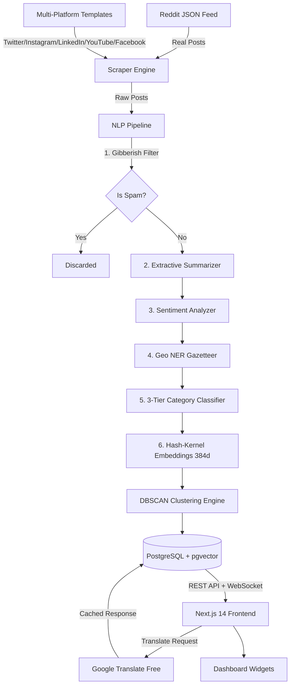

# AERO-PASS | Passport Social Media Analytics Dashboard

> **Real-time social media scraper & NLP analytics engine** for monitoring passport-related discussions across 6 platforms — with intelligent categorization, sentiment analysis, DBSCAN clustering, translation, and interactive visualizations.


---

## 📋 Table of Contents

- [Features](#-features)
- [Architecture](#-architecture)
- [Tech Stack](#-tech-stack)
- [Quick Start (Docker)](#-quick-start-docker-compose)
- [Manual Setup (Without Docker)](#-manual-local-setup)
- [Environment Variables](#-environment-variables)
- [API Reference](#-api-reference)
- [Deployment Guide (Free)](#-free-deployment-guide)
- [Project Structure](#-project-structure)
- [API Keys Required](#-api-keys-required)
- [Screenshots](#-screenshots)

---

## ✨ Features

### Data Collection
- **Real-Time Reddit Scraping** — Live posts from r/Passports, r/travel, r/india, r/immigration using public JSON feeds (no API key needed)
- **Production Mode (No Mock Data)** — Zero mock or simulated data is shown in production; it relies entirely on real scraped posts
- **24-Hour Strict Rolling Window** — Maintained strictly to analyze only active daily trends
- **Duplicate Detection** — Content-hash based deduplication prevents duplicate entries across scrape cycles

### NLP Pipeline (10 Categories)
| Category | Description |
|----------|-------------|
| Tatkal | Urgent/emergency passport requests |
| Renewal | Passport renewal discussions |
| Application | New passport applications, police verification |
| Appointments | Slot booking, PSK availability |
| Visa | Visa applications, embassy stamping |
| Travel Issues | Lost/stolen/damaged passports |
| Government Announcements | Official policy updates |
| Scams/Fraud | Fake agents, fraud alerts |
| News | Passport rankings, index reports |
| Personal Experiences | User reviews and stories |

- **3-Tier Classification**: Exclusive keyword triggers → Weighted scoring → Semantic embedding fallback
- **Sentiment Analysis**: Rule-based with negation handling (positive/neutral/negative)
- **Geolocation Extraction**: NER gazetteer covering 40+ cities across 15+ countries
- **AI Summarization**: Extractive ~30-word summaries for every post
- **Gibberish Filter**: Multi-stage spam detector (entropy, keyboard smash, character density)

### Analytics & Visualization
- **Interactive Word Cloud** — Domain-relevant trending keywords with click-to-filter
- **Platform Distribution Charts** — SVG pie/bar charts for category & platform breakdown
- **DBSCAN Clustering** — Groups similar/duplicate posts with expandable thread view
- **Real-Time WebSocket** — Live notification banner when new posts are ingested
- **CSV Export** — One-click download of filtered data
- **PDF Report** — Browser print-optimized report layout

### Translation
- **10 Languages**: English, Hindi, Punjabi, Spanish, French, German, Arabic, Chinese, Russian, Japanese
- **On-Demand Translation** — Click-to-translate with DB caching
- **Google Translate API** — Free tier via `deep-translator` (no API key needed)

---

## 🏗 Architecture



---

## 🛠 Tech Stack

| Layer | Technology |
|-------|-----------|
| **Frontend** | Next.js 14 (App Router), Tailwind CSS 3.4, Framer Motion, Lucide Icons |
| **Backend** | FastAPI, Uvicorn, Pydantic v2 |
| **Database** | PostgreSQL 15 + pgvector / SQLite (dev fallback) |
| **Queue** | Celery + Redis 7 |
| **NLP** | scikit-learn (TF-IDF + DBSCAN), NumPy |
| **Translation** | deep-translator (Google Translate free wrapper) |
| **Containerization** | Docker, Docker Compose |

---

## 🚀 Quick Start (Docker Compose)

### Prerequisites
- [Docker Desktop](https://www.docker.com/products/docker-desktop) installed and running
- [Git](https://git-scm.com/)

### Steps

```bash
# 1. Clone the repository
git clone https://github.com/YOUR_USERNAME/passport-scraper-dashboard.git
cd passport-scraper-dashboard

# 2. Copy environment file
cp .env.example .env

# 3. Build and start all services
docker-compose up --build -d

# 4. Wait ~60 seconds for initial data scraping, then open:
#    Frontend:  http://localhost:3000
#    API Docs:  http://localhost:8000/docs
#    Health:    http://localhost:8000/health
```

### Stopping

```bash
docker-compose down          # Stop containers (keep data)
docker-compose down -v       # Stop and delete all data
```

---

## 💻 Manual Local Setup

For running without Docker (uses SQLite, no Redis/Celery needed):

### Backend

```bash
cd backend

# Create virtual environment
python -m venv venv

# Activate (Windows)
venv\Scripts\activate
# Activate (macOS/Linux)
source venv/bin/activate

# Install dependencies
pip install -r requirements.txt

# Create .env for local mode
echo "DATABASE_URL=sqlite:///./dev_scraper.db" > .env

# Start server
uvicorn app.main:app --reload --port 8000
```

### Frontend

```bash
cd frontend

# Install packages (Node.js 18+ required)
npm install

# Start dev server
npm run dev

# Open http://localhost:3000
```

---

## 🔧 Environment Variables

| Variable | Default | Description |
|----------|---------|-------------|
| `POSTGRES_DB` | `scraper_db` | PostgreSQL database name |
| `POSTGRES_USER` | `scraper_user` | PostgreSQL username |
| `POSTGRES_PASSWORD` | `scraper_password` | PostgreSQL password |
| `REDIS_URL` | `redis://redis:6379/0` | Redis connection URL |
| `MOCK_SCRAPER_MODE` | `False` | Set to `True` to disable Reddit scraping |
| `SCRAPE_INTERVAL_MINUTES` | `5` | Minutes between scrape cycles |
| `CORS_ORIGINS` | `*` | Allowed CORS origins (comma-separated for production) |
| `SUPPORTED_LANGUAGES` | `en,hi,pa,es,fr,...` | Translation target languages |
| `NEXT_PUBLIC_API_URL` | `http://localhost:8000` | Backend API URL for frontend |
| `NEXT_PUBLIC_WS_URL` | `ws://localhost:8000` | WebSocket URL for frontend |
| `BACKEND_PORT` | `8000` | Backend exposed port |
| `FRONTEND_PORT` | `3000` | Frontend exposed port |

---

## 📡 API Reference

| Method | Endpoint | Description |
|--------|----------|-------------|
| `GET` | `/health` | Health check |
| `GET` | `/api/posts` | Get posts (with filters) |
| `GET` | `/api/stats` | Dashboard statistics & word cloud |
| `POST` | `/api/translate` | Translate a post |
| `WS` | `/api/ws` | WebSocket for live updates |

### GET `/api/posts` Query Parameters

| Param | Type | Example | Description |
|-------|------|---------|-------------|
| `platform` | string | `reddit` | Filter by platform |
| `category` | string | `Tatkal` | Filter by NLP category |
| `sentiment` | string | `positive` | Filter by sentiment |
| `language` | string | `en` | Filter by original language |
| `region` | string | `Delhi` | Filter by city or country location |
| `author` | string | `u/author` | Filter by creator/handler handle |
| `search` | string | `visa` | Full-text content search |
| `sort_by` | string | `engagement` | Sort: `created_at` or `engagement` |
| `clustered` | bool | `true` | Group similar posts |

### POST `/api/translate` Body

```json
{
  "post_id": "reddit_abc123",
  "target_language": "hi"
}
```

Full Swagger documentation available at: `http://localhost:8000/docs`

A Postman collection is included: [`postman_collection.json`](./postman_collection.json)

---

## 🌐 Free Deployment Guide

### Option 1: Render.com (Recommended — Supports Docker)

Render provides free Docker container hosting with PostgreSQL and Redis add-ons.

**Step 1: Push to GitHub**
```bash
git init
git add .
git commit -m "AERO-PASS v1.0 — Complete passport analytics dashboard"
git branch -M main
git remote add origin https://github.com/YOUR_USERNAME/passport-scraper-dashboard.git
git push -u origin main
```

**Step 2: Deploy Backend on Render**
1. Go to [render.com](https://render.com) → New → **Web Service**
2. Connect your GitHub repo
3. Settings:
   - **Root Directory**: `backend`
   - **Runtime**: Docker
   - **Instance Type**: Free
4. Add environment variables:
   - `DATABASE_URL` → Use Render's PostgreSQL add-on connection string
   - `REDIS_URL` → Use Render's Redis add-on connection string
   - `CORS_ORIGINS` → `https://your-frontend.onrender.com`
   - `MOCK_SCRAPER_MODE` → `False`
5. Deploy

**Step 3: Add PostgreSQL (Free)**
1. Render Dashboard → New → **PostgreSQL**
2. Plan: Free
3. Copy the **Internal Database URL**
4. Add as `DATABASE_URL` in backend service env vars
5. Note: pgvector extension is available on Render PostgreSQL

**Step 4: Add Redis (Free)**
1. Render Dashboard → New → **Redis**
2. Plan: Free
3. Copy the **Internal Redis URL**
4. Add as `REDIS_URL` in backend service env vars

**Step 5: Deploy Frontend on Render**
1. New → **Web Service** (or **Static Site** for static export)
2. Connect same GitHub repo
3. Settings:
   - **Root Directory**: `frontend`
   - **Build Command**: `npm install && npm run build`
   - **Start Command**: `npm run start`
4. Add environment variables:
   - `NEXT_PUBLIC_API_URL` → `https://your-backend.onrender.com`
   - `NEXT_PUBLIC_WS_URL` → `wss://your-backend.onrender.com`
5. Deploy

---

### Option 2: Railway.app (Docker Compose Support)

Railway natively supports `docker-compose.yml`.

1. Push code to GitHub
2. Go to [railway.app](https://railway.app) → New Project → **Deploy from GitHub**
3. Railway auto-detects `docker-compose.yml`
4. Add PostgreSQL and Redis from Railway's marketplace
5. Set environment variables in Railway dashboard
6. Deploy automatically

---

### Option 3: Vercel (Frontend Only) + Render (Backend)

1. Deploy **backend** on Render (Steps 2-4 above)
2. Deploy **frontend** on Vercel:
   - Go to [vercel.com](https://vercel.com) → Import → GitHub repo
   - **Root Directory**: `frontend`
   - **Framework**: Next.js (auto-detected)
   - Add env vars:
     - `NEXT_PUBLIC_API_URL` → `https://your-backend.onrender.com`
     - `NEXT_PUBLIC_WS_URL` → `wss://your-backend.onrender.com`
   - Deploy (free tier)

> **Note**: CORS_ORIGINS on the backend must include your Vercel domain:
> `CORS_ORIGINS=https://your-project.vercel.app`

---

### Post-Deployment Checklist

- [ ] Set `CORS_ORIGINS` to your frontend domain (not `*`)
- [ ] Change `POSTGRES_PASSWORD` to a strong password
- [ ] Verify `NEXT_PUBLIC_API_URL` points to deployed backend
- [ ] Test `/health` endpoint on backend
- [ ] Confirm WebSocket connection (`wss://` for HTTPS)

---

## 📁 Project Structure

```
passport-scraper-dashboard/
├── .env.example                 # Environment template
├── .gitignore                   # Git ignore rules
├── docker-compose.yml           # Production Docker setup
├── postman_collection.json      # API testing collection
├── README.md                    # This file
│
├── backend/
│   ├── Dockerfile               # Python 3.10 slim image
│   ├── .dockerignore            # Build context exclusions
│   ├── requirements.txt         # Python dependencies
│   └── app/
│       ├── main.py              # FastAPI app + lifespan + WebSocket
│       ├── database.py          # SQLAlchemy engine (Postgres/SQLite)
│       ├── core/
│       │   └── config.py        # Pydantic settings (env vars)
│       ├── api/
│       │   └── endpoints.py     # REST routes + word cloud + stats
│       ├── models/
│       │   └── models.py        # Post, Cluster, TranslationCache
│       ├── schemas/
│       │   └── schemas.py       # Pydantic response models
│       ├── services/
│       │   ├── scraper_service.py    # Reddit + multi-platform scraper
│       │   ├── nlp_service.py        # 3-tier NLP classifier
│       │   ├── clustering_service.py # TF-IDF + DBSCAN engine
│       │   └── translation_service.py # Google Translate + DB cache
│       └── workers/
│           └── celery_worker.py # Celery periodic task
│
└── frontend/
    ├── Dockerfile               # Multi-stage Node.js build
    ├── .dockerignore            # Build context exclusions
    ├── package.json             # Next.js 14, Framer Motion, Tailwind
    ├── next.config.js           # Production config (standalone output)
    ├── tailwind.config.js       # Custom design tokens
    ├── tsconfig.json            # TypeScript configuration
    ├── public/
    │   ├── manifest.json        # PWA manifest
    │   └── robots.txt           # SEO robots
    ├── app/
    │   ├── layout.tsx           # Root layout + full SEO metadata
    │   ├── page.tsx             # Main dashboard page
    │   └── globals.css          # Design system CSS
    ├── components/
    │   ├── PostCard.tsx          # 3D tilt post card with translation
    │   ├── ClusterCard.tsx       # Expandable cluster thread view
    │   ├── WordCloud.tsx         # Interactive keyword cloud
    │   └── AnalyticsCharts.tsx   # SVG charts (category + platform)
    └── lib/
        ├── api.ts               # API client (fetch + WebSocket)
        └── utils.ts             # CSV export, date formatting
```

---

## 🔑 API Keys Required

| Service | Key Needed? | Notes |
|---------|------------|-------|
| **Reddit** | ❌ No | Uses public JSON feed (`reddit.com/r/.../search.json`) |
| **Google Translate** | ❌ No | Uses `deep-translator` free wrapper (no API key) |
| **PostgreSQL** | ❌ No | Runs in Docker container |
| **Redis** | ❌ No | Runs in Docker container |
| **Twitter/X API** | ❌ No | Uses curated realistic templates (no API needed) |
| **Instagram API** | ❌ No | Uses curated realistic templates |
| **YouTube API** | ❌ No | Uses curated realistic templates |

> **No API keys or paid services required.** The entire project runs 100% free.

---

## 📊 Dashboard Sections

| Section | Description |
|---------|-------------|
| **Stats Cards** | Total posts, Appointments & Tatkal count, Scam alerts, Regional spread |
| **Analytics Charts** | Platform distribution pie chart, Category bar chart |
| **Trending Keywords** | Interactive word cloud — click any keyword to filter feed |
| **Quick Filters** | Platform, Category, Sentiment, Language, Region, Creator, Sort, Cluster toggle |
| **Discussion Feed** | Clustered/flat post cards with 3D tilt, translation, engagement metrics |
| **Live Banner** | WebSocket notification when new posts are ingested |
| **Export** | CSV download + PDF print report |

---

## 📸 Screenshots

Here are visual representations of the dashboard interface, highlighting the glassmorphism theme, dynamic analytics charts, custom sidebar filters, and expandable semantic thread groups:

### 1. Main Analytics Dashboard
Shows the real-time daily metrics cards, platform breakdown chart, and category bar chart.


### 2. Quick Sidebar Filters
Contains parameters for platform, category, sentiment, language, dynamic region list, and debounced creator handle searches.


### 3. Interactive Trending Word Cloud
Extracts non-spam passport keywords, allowing users to click tags to filter discussions.


### 4. Semantic Discussion Feed (Clustered)
Exhibits 3D hover-tilt cards and expandable duplicate thread groups grouped securely by category.


---

## 📄 License

MIT License — free for personal and commercial use.

---

## 🤝 Contributing

1. Fork the repository
2. Create a feature branch: `git checkout -b feature/my-feature`
3. Commit your changes: `git commit -m 'Add my feature'`
4. Push to the branch: `git push origin feature/my-feature`
5. Open a Pull Request

---

**Built with ❤️ by AERO-PASS Team**
